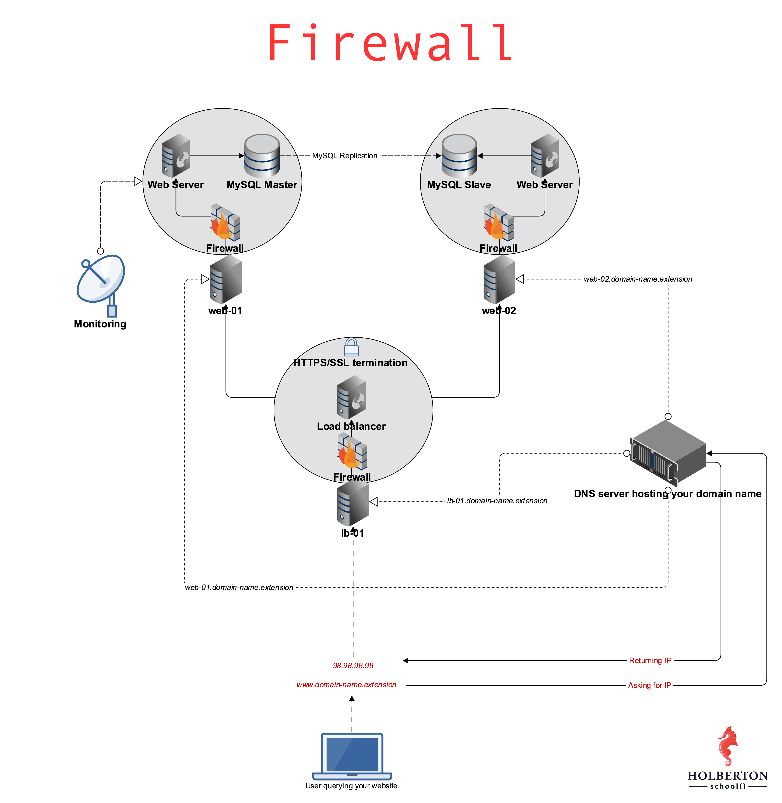

# 0x13. Firewall

## Resources
* [What is a firewall](https://en.wikipedia.org/wiki/Firewall_%28computing%29)

`0-block_all_incoming_traffic_but` script install ufw firewall on Ubuntu and adds firewall rules.
